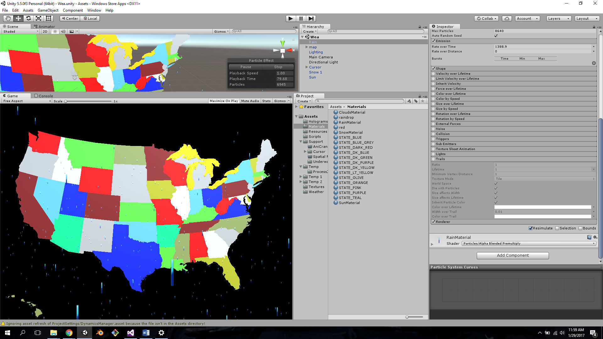
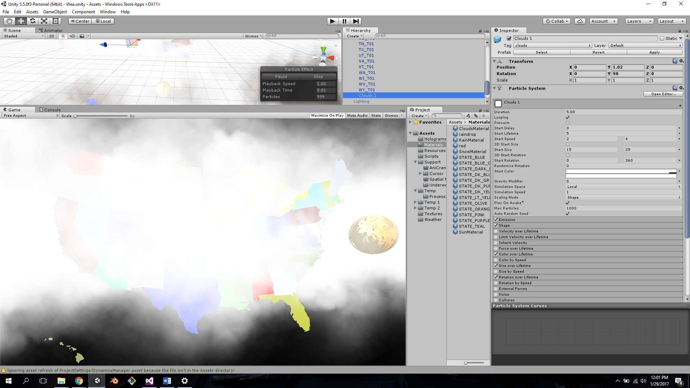
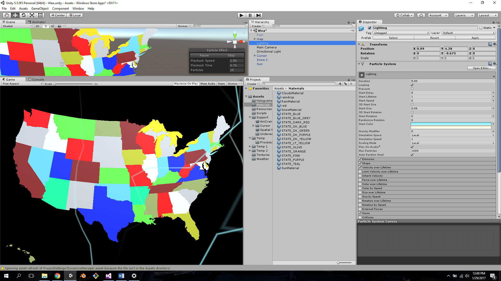
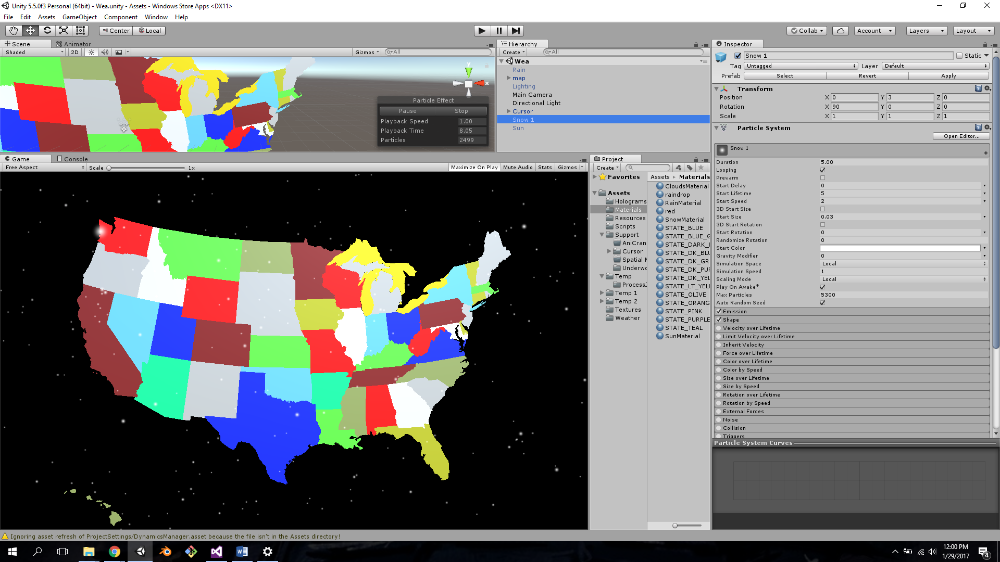

# APSnipers
Daemon dash hackathon

Using Unity for the hololens we used spatial mapping to display the united states directly in front of the user.

Once the user clicks on a state and a image will pop up on the screen based on the weather. 

#Weather
We integrated the Accu wheather API with our application using C#.

#Images

##Rain

##Cloudy and Sunny

##Lightning

##Snow

